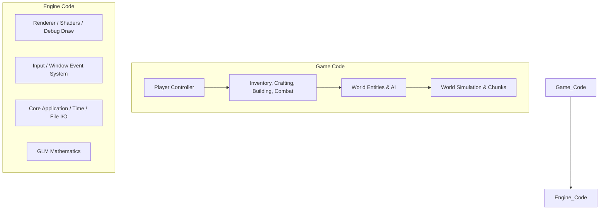

# TECHNICAL PLAN: Realmbound Wilds Custom C++ Engine

## 1. Engine vs. Game Boundary
To maintain code cleanliness and organize the codebase, the project is split into two main sections:
- **Engine**: Handles low-level platform operations, rendering, windowing, raw input, time, file systems, and math. It has zero knowledge of gameplay concepts (e.g., it does not know what an "inventory" or "player" is).
- **Game**: Uses the Engine API to implement game rules, entity state, AI, physics, inventory, crafting, building, and world rendering.



---

## 2. Directory Architecture
The proposed workspace layout is organized as follows:

```
RealmboundWilds/
├── CMakeLists.txt              # Root build script
├── PROJECT_BRIEF.md
├── TECHNICAL_PLAN.md
├── ROADMAP.md
├── Engine/                     # Game-agnostic codebase
│   ├── Core/                   # Application class, Window, Input, Timer, Logging
│   ├── Renderer/               # GLAD/OpenGL wrapper, Shader, Texture, Mesh, Camera, DebugDraw
│   ├── Math/                   # GLM helper functions & vector utilities
│   └── ThirdParty/             # Vendor dependencies (GLAD, GLFW, GLM, ImGui, JSON, STB)
├── Game/                       # Game-specific logic
│   ├── Core/                   # GameInstance, GameLoop, Main entry point
│   ├── Entity/                 # Entity registry/registry systems, Player, Enemy, BaseEntity
│   ├── Systems/                # InventorySystem, CraftingSystem, BuildSystem, CombatSystem
│   ├── World/                  # Chunk management, ResourceNodes, DayNightCycle
│   ├── UI/                     # ImGui-based Game HUD and Debug overlays
│   └── Config/                 # C++ structures mapping to item databases (JSON)
├── Assets/                     # Read-only runtime assets
│   ├── Shaders/                # Vertex/Fragment GLSL shaders
│   ├── Textures/               # PNG/TGA textures (UI icons, terrain maps, entity skins)
│   ├── Models/                 # OBJ/FBX static meshes (placeholders)
│   └── Config/                 # JSON databases (items.json, recipes.json)
└── Saves/                      # Dynamic save data folder
```

---

## 3. Technology Stack & Third-Party Libraries
To optimize for a solo developer and keep compilation times low, we use proven, lightweight libraries:
- **Windowing & Input**: GLFW (cross-platform, reliable).
- **Graphics API**: OpenGL 3.3 / 4.1 Core profile (broad compatibility, simple pipeline setup).
- **OpenGL Loader**: GLAD (lightweight, generated loader).
- **Mathematics**: GLM (header-only, matches GLSL shading language constructs).
- **Debug & UI**: Dear ImGui (excellent for developer tooling, debug menus, and quick UI mockups).
- **Serialization**: nlohmann/json (industry standard for C++ JSON reading/writing).
- **Texture Loading**: stb_image (single-header image loader).
- **Build System**: CMake (cross-platform, handles external dependencies cleanly).

---

## 4. Core Game Systems Architecture

### A. Entity System
We will use a simple Object-Oriented Entity-Component model or a lightweight C++ registry to keep systems decoupled:
- **`BaseEntity`**: Base class containing unique ID, Transform, active status, and virtual lifecycle hooks (`OnSpawn()`, `Update(float dt)`, `Render()`, `OnDestroy()`).
- **`Player` (inherits `BaseEntity`)**: Contains health, stamina, inventory, current equipment, movement states, and camera math.
- **`Enemy` (inherits `BaseEntity`)**: Contains AI state machine, patrol path, detection radius, and attack metrics.
- **`ResourceNode` (inherits `BaseEntity`)**: Contains node type (Tree, Stone), current health, required tool tier, and drop tables.

### B. Inventory & Item Data
- **`ItemDefinition` (Data-driven)**: Loaded from `Assets/Config/items.json` at startup. Struct contains:
  ```cpp
  struct ItemDefinition {
      std::string id;
      std::string displayName;
      std::string description;
      std::string itemType; // e.g., "Weapon", "Tool", "Resource", "Consumable"
      int maxStackSize;
      float weight;
      int resourceTier;
      // Equipment stats
      int damage;
      int armor;
      float staminaCost;
  };
  ```
- **`ItemStack`**: Representation of items in slots.
  ```cpp
  struct ItemStack {
      std::string itemId; // Refers to ItemDefinition ID
      int count;
  };
  ```
- **`Inventory`**: Manages an array of `ItemStack`s, hotbar, and active equipment. Exposes helper methods: `AddItem(id, count)`, `RemoveItem(id, count)`, `HasItem(id, count)`.

### C. Crafting System
- **`Recipe`**: Loaded from `Assets/Config/recipes.json` at startup:
  ```cpp
  struct Ingredient {
      std::string itemId;
      int quantity;
  };
  struct Recipe {
      std::string recipeId;
      std::string outputItemId;
      int outputQuantity;
      std::vector<Ingredient> ingredients;
      std::string requiredStation; // e.g., "None", "Workbench", "Forge"
      int requiredStationLevel;
  };
  ```
- **`CraftingManager`**: Checks recipes against player inventory and station proximity. Performs crafting actions, deducts materials, and inserts outputs.

### D. Building System
- **`BuildPiece`**: A structure definition of a placeable entity (e.g., Floor, Wall, Roof, Column).
- **`BuildSystem`**:
  - Monitors input to toggle "Build Mode".
  - Instantiates a transparent "ghost" mesh at the intersection point of a raycast from the player camera to the terrain/existing objects.
  - Handles rotation with mouse scroll.
  - Verifies placement costs and clearances.
  - On confirm (Left Click), instantiates the actual entity into the world registry and deducts building cost.

---

## 5. Save/Load Serialization Approach
Saves are serialized to clean, readable JSON format using `nlohmann/json`:
- **`PlayerSave`**: Saves player transform, health, stamina, inventory items, and hotbar.
- **`WorldSave`**:
  - Saves the world seed.
  - Saves all active/built structures (type, transform, current health).
  - Saves the state of harvested resource nodes (positions and respawn timers).
- **`GameSave`**: Saves general metadata like current time of day, active world state, and boss/stabilization achievements.

---

## 6. Testing & Debug Strategy
Since this is a custom C++ engine, custom debug systems are crucial for developer speed:
1. **ImGui Debug Overlay**:
   - Toggled via `F1`.
   - Displays real-time framerate, frame time, draw calls, and entity counts.
   - Provides dev shortcuts: Spawn Item dropdown, Teleport, Time-of-day slider, God mode, Heal, and Clear Enemies.
2. **Debug Drawer**:
   - A line/box renderer that bypasses depth buffers.
   - Used to draw bounding boxes (AABBs), raycasts, pathfinding grids, and enemy sight lines.
3. **Console Logging**:
   - A thread-safe, colored console logger (outputting to both stdout and a file `log.txt`) with tags `[INFO]`, `[WARNING]`, `[ERROR]`, `[DEBUG]`.
